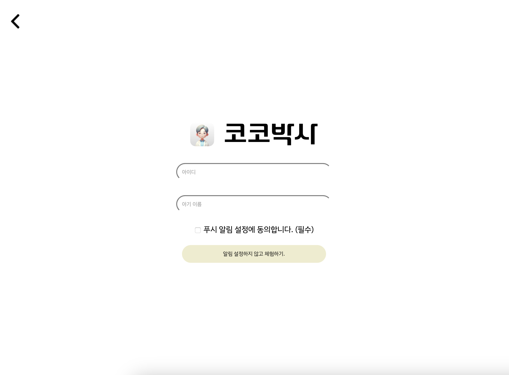
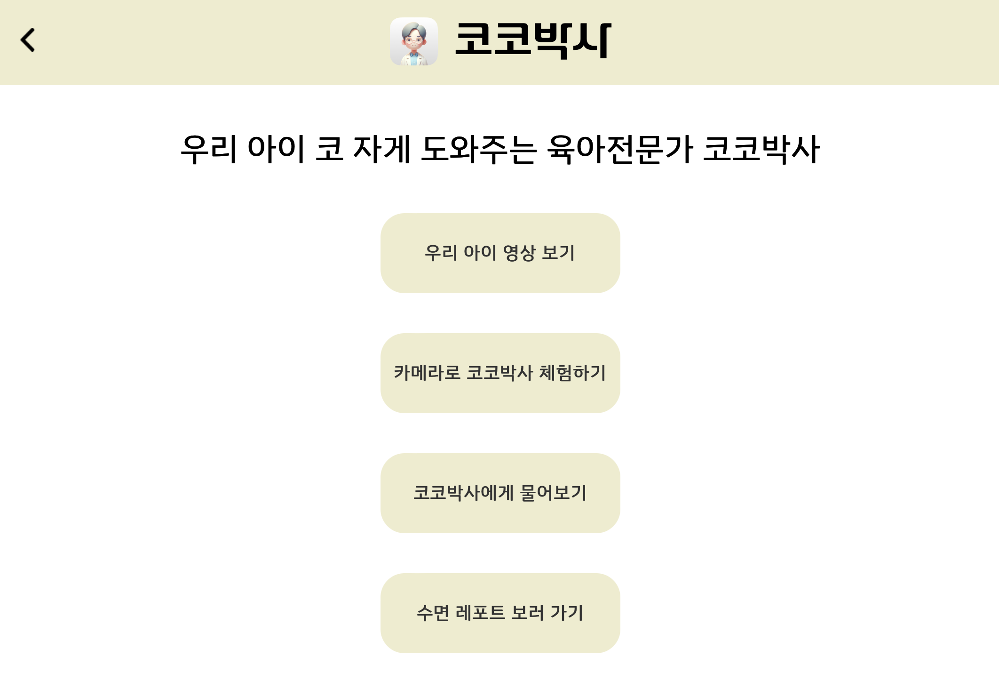
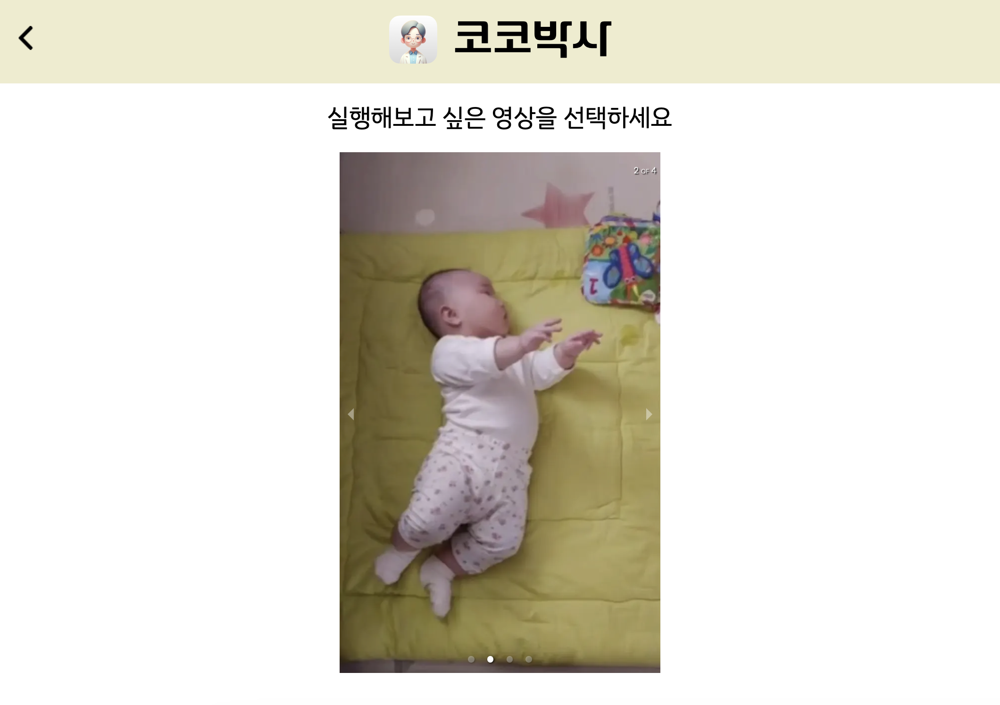
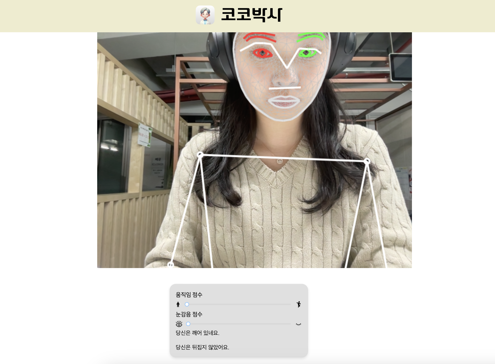
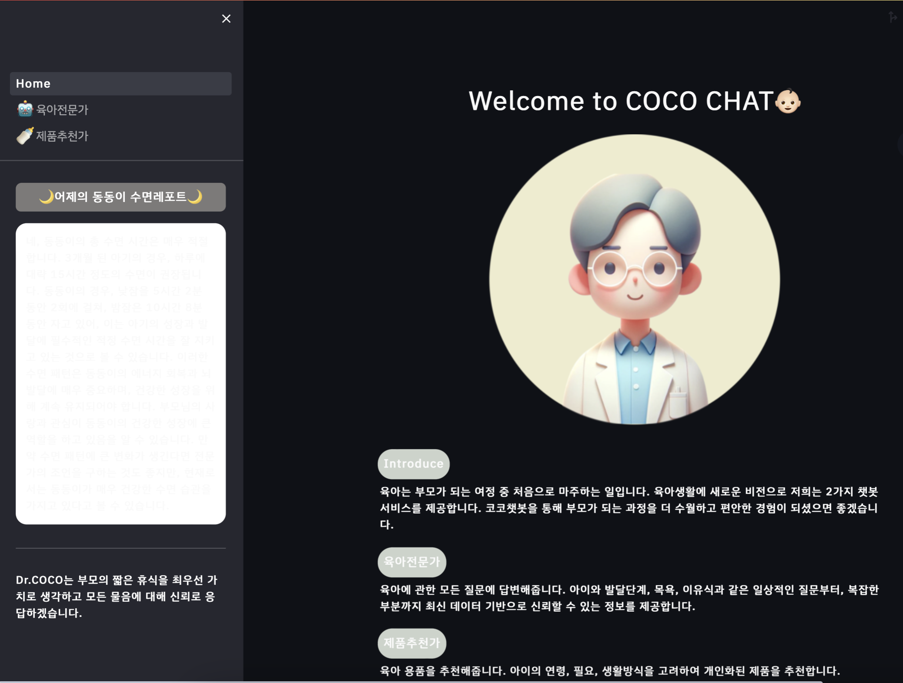
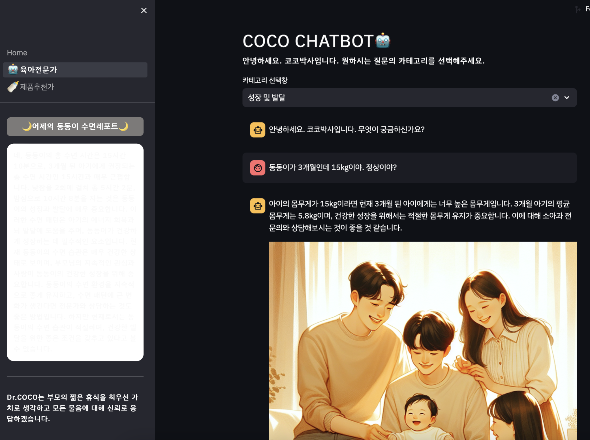
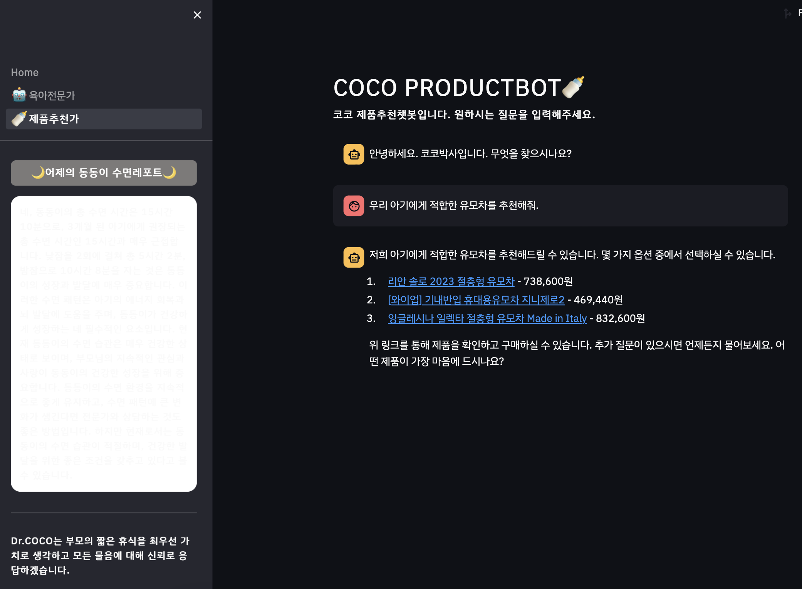
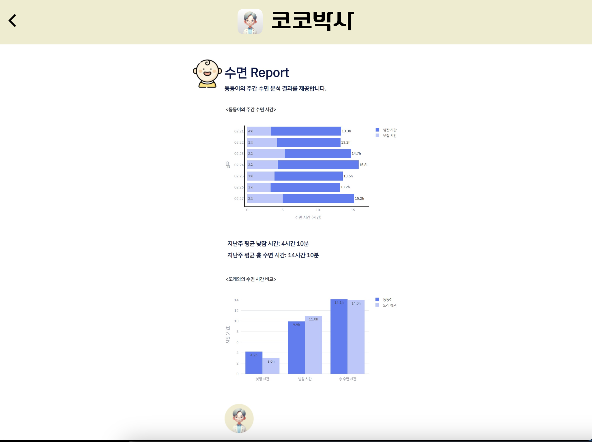
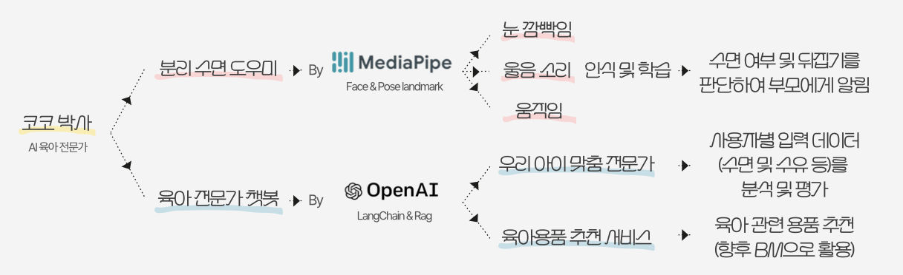

# 코코박사

<div align="center">
<!--  -->


<!-- [](https://hits.seeyoufarm.com) -->

</div>

# Dr.COCO
> **SKT FLY AI 4기 열정 5조** <br/> 
**개발기간: 2023.12.28 ~ 2024.2.28**

## 배포 주소

[https://fly-ai-front-test.azurewebsites.net/](https://fly-ai-front-test.azurewebsites.net/) <br>
<!-- > **프론트 서버** : [http://voluntain.cs.skku.edu:33307/](http://voluntain.cs.skku.edu:33307/)<br>
> **백엔드 서버** : [http://voluntain.cs.skku.edu:2223/](http://voluntain.cs.skku.edu:2223/)<br> -->

## 웹 개발팀 소개

- 오서영 : 프론트엔드
- 임태규(팀장) : 백엔드
- 김선아 : 백엔드
- 김시원 : 프론트엔드
- 우정아 : 백엔드
- 주동근 : 기획


<!-- |      박지예       |          서채연         |       이현정         |                                                                                                               
| :------------------------------------------------------------------------------: | :---------------------------------------------------------------------------------------------------------------------------------------------------: | :---------------------------------------------------------------------------------------------------------------------------------------------------------------------------------------------------: | 
|       |                          |                      |
|   [@parkjiye](https://github.com/parkjiye)   |    [@ChaeyeonSeo](https://github.com/ChaeyeonSeo)  | [@hyunjeong408](https://github.com/hyunjeong408)  |
| 성균관대학교 소프트웨어학과 4학년 | 성균관대학교 소프트웨어학과 4학년 | 성균관대학교 소프트웨어학과 4학년 | -->

## 프로젝트 소개

- 와이파이 캠으로 입력된 영상에 대한 복합적 분석을 통해 수면 상황을 부모에게 알려, 아이의 수면 시간 동안 편안한 휴식이 가능하게 합니다.
- 기 학습된 의학 자료 및 우리 아기만의 육아 정보를 추가로 학습하여, 연령 및 상황별 적절한 육아 지식을 공부해야 할 수고로움을 줄여 줍니다.

<!-- #### Voluntain will share the knowledge of programming.
You can take easy-to-understand lectures created by our team, including Scratch and Python. Also, improve your understanding and application skills of programming with exercise questions in the lecture videos.

#### Voluntain's website will give you a learning-friendly environment.

Our website supports the following component.
1. Various online lectures with detailed descriptions and exercise questions.
2. Q&A section to ask questions freely.
3. Function to check the lecture you watched recently. -->

## 시작 가이드
<!-- ### Requirements
For building and running the application you need:

- [Node.js 14.19.3](https://nodejs.org/ca/blog/release/v14.19.3/)
- [Npm 9.2.0](https://www.npmjs.com/package/npm/v/9.2.0)
- [Strapi 3.6.6](https://www.npmjs.com/package/strapi/v/3.6.6) -->

### Installation
1. Repository 클론
```bash
git clone https://github.com/SeoyoungOhMe/Dr.COCO_Fly_AI.git
```
2. NPM packages 설치
```bash
npm install
```
3. build 스크립트 실행
```bash
npm run build
```
4. dev 스크립트 실행
```bash
npm run dev
```
---

## Stacks 🐈

### Environment


             

### Config
        

### Development
> **프론트엔드 개발** </br></br>


</br>

> **백엔드 개발** </br></br>


### Communication


---
## 화면 구성 📺
| 시작 페이지  |  메인 페이지   |
| :-------------------------------------------: | :------------: |
|   |  |  
| 영상 선택 페이지   |  영상 실행 페이지   |  
|    |       |
| 웹캠 페이지  |  코코챗 메인 페이지   |
|   |  |  
| 육아전문챗 페이지  |  제품추천챗 페이지   |
|   |  | 
| 수면패턴 분석 페이지  |     |
|   |  | 

---
## 주요 기능 📦



### ⭐️ 영상에서 아기의 수면, 뒤집음 여부 판단
- 4개의 예시 영상 중 하나를 선택해 실행하면, 움직임과 눈감음 정도가 나옵니다. 이를 통해 수면 여부를 파악하고, Mediapipe의 Pose Landmark를 통해 뒤집음 여부를 판단합니다. 그리고 아이가 뒤집거나 깬 돌발 상황에 대해 알림을 주고 코코박사의 코멘트가 하단에 나옵니다.

### ⭐️ 웹캠에서 아기의 수면, 뒤집음 여부 판단
- 실시간으로 웹캠을 통해 움직임과 눈감음 정도, 수면 여부와 뒤집기 여부를 화면에 나타냅니다.

### ⭐️ 코코챗 육아 전문 챗봇과 제품 추천 챗봇
- **육아전문가 챗봇** : 카테고리를 선택 후 육아 관련 질문을 챗봇에게 하면 답변과 생성형 AI로 만든 관련 이미지가 나옵니다.
- **제품추천가 챗봇** : 육아 제품 추천을 해줍니다.

### ⭐️ 수면 레포트 
- 아기의 주간 수면 분석 결과, 또래와의 수면 시간 비교, 코코박사의 조언 등이 나옵니다.


---
<!--
## 아키텍쳐

### 디렉토리 구조
```bash
├── README.md
├── package-lock.json
├── package.json
├── strapi-backend : 
│   ├── README.md
│   ├── api : db model, api 관련 정보 폴더
│   │   ├── about
│   │   ├── course
│   │   └── lecture
│   ├── config : 서버, 데이터베이스 관련 정보 폴더
│   │   ├── database.js
│   │   ├── env : 배포 환경(NODE_ENV = production) 일 때 설정 정보 폴더
│   │   ├── functions : 프로젝트에서 실행되는 함수 관련 정보 폴더
│   │   └── server.js
│   ├── extensions
│   │   └── users-permissions : 권한 정보
│   ├── favicon.ico
│   ├── package-lock.json
│   ├── package.json
│   └── public
│       ├── robots.txt
│       └── uploads : 강의 별 사진
└── voluntain-app : 프론트엔드
    ├── README.md
    ├── components
    │   ├── CourseCard.js
    │   ├── Footer.js
    │   ├── LectureCards.js
    │   ├── MainBanner.js : 메인 페이지에 있는 남색 배너 컴포넌트, 커뮤니티 이름과 슬로건을 포함.
    │   ├── MainCard.js
    │   ├── MainCookieCard.js
    │   ├── NavigationBar.js : 네비게이션 바 컴포넌트, _app.js에서 공통으로 전체 페이지에 포함됨.
    │   ├── RecentLecture.js
    │   └── useWindowSize.js
    ├── config
    │   └── next.config.js
    ├── lib
    │   ├── context.js
    │   └── ga
    ├── next.config.js
    ├── package-lock.json
    ├── package.json
    ├── pages
    │   ├── _app.js
    │   ├── _document.js
    │   ├── about.js
    │   ├── course
    │   ├── index.js
    │   ├── lecture
    │   ├── newcourse
    │   ├── question.js
    │   └── setting.js
    ├── public
    │   ├── favicon.ico
    │   └── logo_about.png
    └── styles
        └── Home.module.css

``` -->
